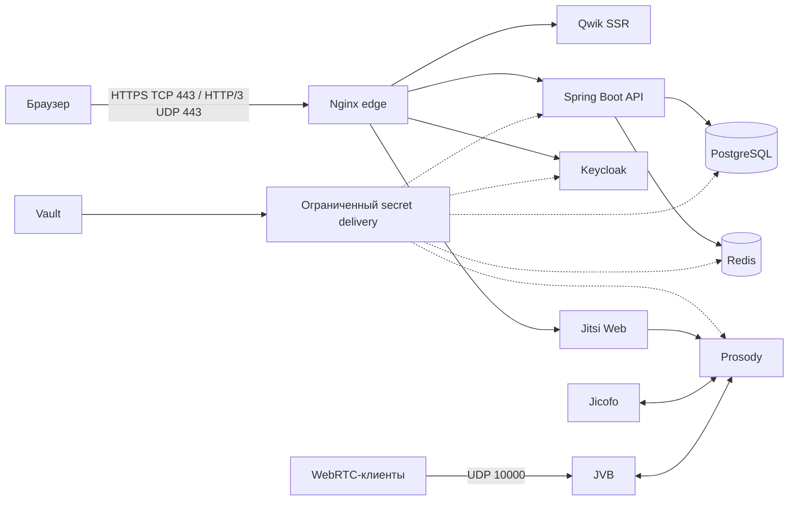

# Custom Jitsi Portal

Self-hosted веб-портал для управления комнатами и встречами Jitsi: единый вход через Keycloak, роли и приглашения гостей, административный контур, мониторинг версий и production-oriented развёртывание.

> Проект находится в активной разработке. Репозиторий содержит hardened production baseline, но публикация требует подготовки DNS, TLS, NAT/firewall, секретов и обязательного внешнего media smoke-теста. Совместимость API между коммитами пока не гарантируется.

## Возможности

- создание комнат и встреч с отдельными ролями организатора, модератора и участника;
- вход через OIDC/Keycloak, профиль пользователя и tenant-scoped каталог;
- приглашения гостей с ограничением срока и числа использований, а также возможностью отзыва;
- административное редактирование профилей в пределах tenant, просмотр ролевой истории и управление конфигурациями окружений;
- журналирование критичных изменений и история назначений ролей;
- инвентаризация закреплённых версий и проверка их на известные критические CVE через OSV;
- выдача подписанного JWT для входа в Jitsi без публичной страницы создания конференций;
- метрики, алерты и Grafana/Prometheus overlay для эксплуатационных проверок.

## Архитектура



В production сервисы разделены на edge, application, identity, realtime, data, secret и operations trust zones. На хосте публикуются только:

- `80/tcp` — HTTP redirect и ACME HTTP-01 при необходимости;
- `443/tcp` — портал, OIDC и Jitsi по каноническим hostname;
- `443/udp` — HTTP/3 QUIC к тому же Nginx edge с HTTP/2 fallback через `443/tcp`;
- `10000/udp` — медиатрафик Jitsi Videobridge.

Backend, Keycloak, PostgreSQL, Redis, Vault и monitoring-интерфейсы напрямую наружу не публикуются. Это инвариант Compose, а не доказательство корректной настройки роутера и host firewall.

## Технологический стек

| Контур | Технологии |
| --- | --- |
| Backend | Java 25, Spring Boot 4.1.0, Spring Modulith 2.1.0, Gradle 9.7 |
| Frontend | Qwik/Qwik Router 2.0.0-beta.38, Qwik UI 0.7.7, TypeScript 5.9, Vite 7, Tailwind CSS 4 |
| Данные | PostgreSQL 18.4, Redis 8.4.5, Flyway |
| Identity | Keycloak 26.7.0, OAuth 2.0/OIDC, Spring Security |
| Видеосвязь | Jitsi Web, Prosody, Jicofo и JVB |
| Секреты | Vault 1.21.4, response-wrapped AppRole, service-specific delivery |
| Edge и observability | Nginx 1.30.4, OpenTelemetry, Prometheus 3.13.2 LTS, Alertmanager 0.33.1, Grafana 11.6.14-security-04 |
| Quality gates | JUnit, Vitest, ArchUnit, Spring Modulith, PMD, CPD, ESLint |

Dev и production используют одну rootless-группу Jitsi `stable-11146-1` из GHCR с digest pinning. Все четыре образа обновляются только синхронно; web-контейнер слушает непривилегированные порты `8000/8443`, а внешний UDP-порт JVB остаётся настраиваемым.

## Структура репозитория

```text
backend/                             Spring Boot API, доменные модули и миграции
frontend-qwik/                       Qwik SSR-приложение и UI-тесты
deploy/                              Nginx, Vault, host и runtime policy artifacts
docs/                                архитектура, безопасность и runbooks
pilot/                               Keycloak realms и Jitsi-конфигурация
scripts/                             validators, bootstrap, backup и smoke-сценарии
openapi.generated.json               воспроизводимый runtime-снимок OpenAPI
docker-compose.yml                   локальный dev stack
docker-compose.monitoring.yml        monitoring overlay для dev
docker-compose.production.yml        hardened production stack
docker-compose.production.monitoring.yml  private monitoring overlay для production
```

## Требования

Для локальной разработки:

- Docker Engine и Docker Compose plugin;
- Node.js `>=24.18.0 <25` и npm;
- Python 3, доступный как `python`;
- JDK 25 для локальной сборки backend и полного `npm run verify`.

Для production-подготовки дополнительно нужны POSIX `sh`, `openssl`, `awk`, `mktemp`, доступ к DNS и способ выпустить доверенный сертификат. Container-backed backend-тесты на Testcontainers требуют работающий Docker.

## Быстрый локальный старт

```powershell
git clone https://github.com/tnag700/custom-jitsi-portal.git
Set-Location custom-jitsi-portal
npm ci
npm --prefix frontend-qwik ci
Copy-Item .env.example .env
npm run stack:up
```

Для Linux/macOS замените `Copy-Item` на `cp`. Файл `.env` нужен только для переопределения локальных defaults и не коммитится.

`stack:up` проверяет dev-конфигурацию, подготавливает локальный Vault и запускает Compose в foreground. Остановка — `Ctrl+C`, последующая очистка контейнеров и сети без удаления volumes:

```powershell
npm run stack:down
```

Monitoring overlay запускается отдельно:

```powershell
npm run stack:up:monitoring
```

### Локальные адреса

| Сервис | Адрес |
| --- | --- |
| Портал | `http://localhost:3000` |
| Backend API | `http://localhost:8080/api/v1` |
| Backend health | `http://localhost:8080/actuator/health` |
| Swagger UI | `http://localhost:8082` |
| Keycloak | `http://localhost:8081` |
| Jitsi HTTP / HTTPS | `http://localhost:8000` / `https://localhost:8443` |
| Prometheus / Alertmanager | `http://localhost:9090` / `http://localhost:9093` |
| Mock alert receiver / Grafana | `http://localhost:9080/notifications` / `http://localhost:3001` |

Для доступа к dev-стенду из LAN согласованно задайте в `.env` значения `DEV_BACKEND_ORIGIN`, `DEV_PUBLIC_API_URL`, `DEV_KEYCLOAK_ORIGIN`, `DEV_PORTAL_ORIGIN` и адрес JVB. Если realm уже импортирован, отдельно обновите callback клиента `jitsi-backend`.

Production-контур открывается по каноническим DNS-именам, а не через `http://LAN_IP:80`: OIDC issuer, callbacks, cookies и TLS привязаны к hostname. Для LAN-клиентов нужен рабочий split DNS или NAT hairpin.

## Разработка и проверки

Основные команды из корня репозитория:

| Команда | Назначение |
| --- | --- |
| `npm run frontend:dev` | Vite/Qwik SSR dev server |
| `npm run frontend:build` | production build frontend |
| `npm run frontend:start` | запуск собранного SSR bundle |
| `npm run frontend:verify:ssr` | build и SSR/resumability smoke |
| `npm run stack:validate` | проверка dev Compose и realm invariants |
| `npm run stack:config` | подготовка dev Vault и рендер Compose-конфигурации |
| `npm run contracts:check` | сверка OpenAPI и frontend-типов |
| `npm run observability:alerting:validate` | проверка Prometheus/Alertmanager artifacts |
| `npm run prod:secret:baseline:validate` | проверка private Vault secret-plane |
| `npm run prod:secret:auth:validate` | проверка workload/operator auth boundaries |
| `npm run verify` | полный репозиторный quality gate |

`stack:config` не является чисто read-only командой: перед рендером он запускает dev Vault preparation и создаёт ignored operator artifacts.

Backend можно проверять отдельно:

```powershell
Set-Location backend
.\gradlew.bat test
.\gradlew.bat build
```

В POSIX shell используйте `./gradlew`. Доступны также `testUnit`, `testSlice`, `testIntegration`, `testContainer`, `testSmoke` и `generateOpenApiSpec`. Категории backend-проверок: `unit / slice / non-container integration / container`.

Перед публикацией изменений запускайте:

```powershell
npm run verify
```

Гейт проверяет backend tests, архитектурные границы, статический анализ, OpenAPI-контракт, frontend tests, TypeScript, SSR/client builds, ESLint и dev/production guardrails. Он не заменяет health checks и browser/WebRTC smoke на реальном стенде.

## Production

Production — отдельный контур. Не используйте `.env.example`, dev realm, seeded users или локальные секреты в production.

Статические проверки, не требующие реальных operator files:

```powershell
npm run prod:baseline:validate
npm run prod:host:baseline:validate
npm run prod:config
```

Для новой пустой установки сначала подготавливается закрытый operator-контур:

```powershell
npm run prod:operator:prepare
npm run prod:vault:bootstrap
npm run prod:preflight
```

После bootstrap перенесите Vault recovery material и CA signing key в approved offline custody, поднимите и проверьте private service plane без nginx/Jitsi media и подготовьте проверяемый rollback. Точный порядок приведён в [production deployment guide](docs/deployment-production.md); он обязателен, если Vault уже инициализирован, база восстанавливается из dev или меняется active config set.

Только после прохождения pre-cutover gates запускается публичный контур:

```powershell
npm run prod:up
```

Эта команда сразу публикует host ports `80/tcp`, `443/tcp`, `443/udp` и `10000/udp`. После запуска выполните внешние acceptance-проверки ниже; при их провале используйте подготовленный rollback.

Важные свойства production workflow:

- `prod:operator:prepare` сам создаёт `.env.production` и отказывается перезаписывать существующий файл;
- `prod:operator:prepare` готовит internal Vault PKI, но не выпускает публичный edge-сертификат;
- реальные секреты, Vault recovery material и TLS private keys остаются вне Git;
- repo-managed env files содержат только non-secret config и path hints;
- CA signing key хранится в operator custody и не должен находиться в runtime-mounted Vault TLS directory;
- `prod:preflight` fail-closed проверяет DNS, сертификаты, secret files, permissions и конфигурационные контракты;
- `prod:up` запускает project `jitsi-prod` в detached mode и ожидает health до 300 секунд;
- `prod:down` сохраняет named volumes; удаление volumes не является способом rollback;
- monitoring overlay включается через `npm run prod:up:monitoring`, но Alertmanager по умолчанию использует mock receiver для drill. До эксплуатационной приёмки настройте и проверьте реальный webhook.

### DNS, NAT, HTTP/3 и JVB

Production использует три канонических имени из `.env.production`:

- `PORTAL_HOST` — портал;
- `AUTH_HOST` — Keycloak/OIDC;
- `MEET_HOST` — Jitsi.

Все public DNS-записи должны указывать на внешний адрес роутера. На VM отдельно пробрасываются `80/tcp`, `443/tcp`, `443/udp` и `10000/udp`: UDP `443` — HTTP/3 до Nginx, а UDP `10000` — WebRTC media до JVB. Для LAN предпочтителен split DNS на LAN-адрес VM; если клиенты используют public address, NAT hairpin должен работать и для UDP `443`. Для split-horizon JVB задайте оба кандидата без пробелов:

```dotenv
JVB_ADVERTISE_IPS=LAN_IP,PUBLIC_IP
```

Изменение переменной требует recreate контейнера JVB, обычный restart не обновляет environment. Проверка Compose и health доказывает только конфигурацию; реальный NAT подтверждается звонком минимум с тремя участниками, включая LAN и внешнего клиента, и выбранной ICE-парой на `10000/udp`.

HTTP/3 вводится как canary с `Alt-Svc: h3=":443"; ma=300`, при этом `ssl_early_data off` и TCP-путь HTTP/2 fallback остаются обязательными. Для rollback сначала отдайте `Alt-Svc: clear` по TCP на всех трех hostname, выждите ранее объявленный `ma` и только затем закрывайте UDP `443`; JVB UDP `10000` при этом не меняется.

### Production acceptance

После cutover и до завершения публичной приёмки должны быть подтверждены:

- `npm run verify`, production baseline и live preflight;
- валидный SAN-сертификат для всех трёх hostname;
- healthy state всех long-lived сервисов и успешное завершение one-shot bootstrap jobs;
- вход через OIDC, logout, создание встречи и гостевой invite flow;
- HTTP/3 `h3` из внешней сети на portal, auth и meet, а также HTTP/2 fallback при client-side block UDP `443`;
- LAN и внешний WebRTC media path через JVB;
- реальный alert receiver, backup и проверяемый restore/unseal procedure;
- отсутствие опубликованных management/data ports и dev-контейнеров.

## Модель безопасности

- Keycloak отвечает за идентификацию, backend — за авторизацию и tenant boundaries.
- Платформенные роли не равны ролям встречи: администратор портала не становится автоматически организатором конференции.
- Гость входит только по действительному invite token, всегда как участник и без полноценной portal session.
- Frontend скрывает недоступные действия только для удобства; окончательное решение всегда принимает backend.
- Jitsi принимает подписанный JWT, а публичная landing page не используется как обход портала.
- Vault не публикуется на host network; workload-доступ ограничен policy и одноразовым bootstrap-контуром.
- frontend SSR по умолчанию не становится Vault client; браузер никогда не получает workload credentials.
- Forwarded headers, публичные Keycloak paths, rate limits и least-privilege/read-only posture с документированными исключениями контролируются валидаторами.

OSV-монитор отвечает на вопрос, затронута ли закреплённая версия известной уязвимостью; он не является auto-updater или универсальным поиском последних релизов.

Runtime Vault собирается по committed definition `deploy/vault/Dockerfile`, закрепляющему approved Yandex mirror artifact path и checksum policy. Ротация, custody и аварийный доступ описаны отдельно в [secret governance matrix](deploy/vault/secret-governance-matrix.md) и [break-glass runbook](deploy/vault/break-glass-runbook.md).

Канонические правила находятся в [матрице доступа](docs/access-control.md) и [модели угроз](docs/threat-model.md).

## Документация

| Документ | Содержание |
| --- | --- |
| [Production deployment](docs/deployment-production.md) | DNS, TLS, Keycloak, Vault, миграция, запуск и smoke checklist |
| [Operations runbook](docs/runbook.md) | диагностика alerts и эксплуатационные действия |
| [Access control](docs/access-control.md) | платформенные роли, роли встречи и guest invariants |
| [Threat model](docs/threat-model.md) | trust boundaries, угрозы и release evidence |
| [Framework/CVE monitoring](docs/framework-version-monitoring.md) | OSV flow, severity policy и реакция оператора |
| [Refactoring roadmap](docs/refactoring-roadmap.md) | архитектурный baseline и дальнейший backlog |
| [Runtime policy matrix](deploy/runtime/production-runtime-policy-matrix.md) | capabilities, read-only и writable exceptions по сервисам |
| [Ubuntu host baseline](deploy/host/README.md) | SSH, UFW, AppArmor, audit и host hardening |
| [Vault baseline](deploy/vault/README.md) | secret topology, auth model и custody rules |
| [Secret governance](deploy/vault/secret-governance-matrix.md) | rotation, ownership и delivery surfaces |
| [Break-glass runbook](deploy/vault/break-glass-runbook.md) | аварийный доступ, аудит и post-use rotation |

## Состояние проекта

Проект развивается итеративно и ориентирован на self-hosted single-host deployment. Для каждого production-изменения сохраняйте проверяемый rollback, не смешивайте dev/prod volumes и обновляйте Jitsi compatibility group только целиком.
