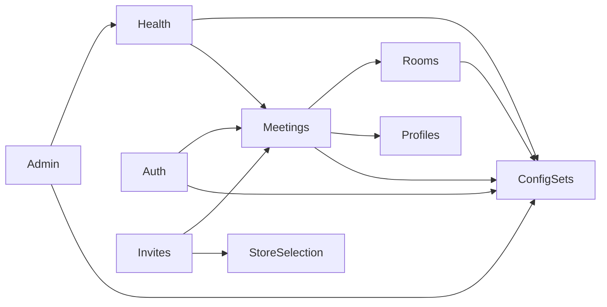

# Architecture refactor, 2026-09-30

The portal remains a Spring Modulith application with a Qwik frontend. The
refactor removes fixed extension pipelines and obsolete positional APIs while
preserving authorization, tenant boundaries, CSRF, idempotency and transaction
ordering. It introduces no dependencies, database migrations or deployment
configuration changes.

## Accepted changes

- The frontend import guard uses the existing TypeScript compiler to resolve
  aliases, relative imports, reexports and type-only references consistently.
  Its regression suite covers 21 cases.
- Config-set startup validation and token compatibility policy belong to
  configsets; service stability metrics belong to health. Shared and security
  packages no longer import business domains. Public module APIs expose named
  types instead of whole implementation packages.
- Meeting role resolution and invite validation use explicit ordered checks.
  The former policy/validator pipelines and their support types were removed.
  Denial precedence, invite reservations and rollback remain covered by tests.
- Native Qwik action types replace form casts. Successful participant responses
  are validated with the existing Zod schemas; optional profile fields normalize
  to null while identity and role fields remain required.
- Room snapshots perform reads without config-set lookups. Meeting creation
  validates the config set once after acquiring the room lock, inside the
  existing transaction and before the room-active check. Meeting updates retain
  their room-before-meeting lock order.
- Join failures are classified once for both event publication and logging.
- Meeting and participant services take the existing request context directly;
  obsolete positional overloads were removed. Wire methods, URLs, payloads and
  request headers remain unchanged.
- Obsolete Oh My Codex instructions were removed from AGENTS.md; the autonomy
  directive and Lore commit protocol remain.

## Business module dependencies

The generated Spring Modulith graph contains nine modules and twelve directed
dependencies. Cross-cutting security and shared packages are outside this graph
and have a separate rule prohibiting dependencies on business domains.

The frontend graph has 175 production files and 495 import edges: 364 value
imports and 131 type-only imports. No runtime import cycle was found. These
counts describe the final refactor snapshot, not a general guarantee for future
changes; the architecture gates run during `npm run verify`.

## Verification and release boundary

`npm run verify` passed using the repository's pinned Node 24.21.0: 647 frontend
tests, the 21-case import guard, backend quality and architecture checks,
contract generation checks, frontend build/typecheck/lint, production baseline
validators and 31 Python plus one Node operations regression test. The full
backend execution recorded 934 tests in 199 suites, with 868 executed and 66
skipped; the separate architecture execution passed 23 tests in four suites.
The final release verification reused up-to-date backend outputs.

Independent release review found no changed persisted event class names,
listener IDs, database migrations, dependency versions or production settings.
Rollback can restore the previous application images without reverse migrations.

Browser acceptance is still unavailable because the browser tool could not
verify its administrative access policy. Server health, TLS, SSR and HTTP
checks do not establish authenticated browser behavior or two-client WebRTC.
The existing participant-action page reload remains until a real browser check
can cover action failure followed by success, filters and loader refresh.
The remaining 61 positional calls in other test files are follow-up cleanup;
no production caller uses the removed overloads.
