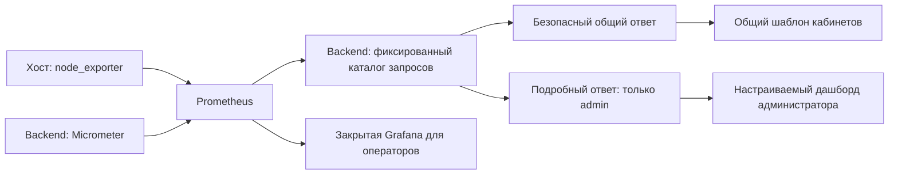

# Метрики в личных кабинетах и административный дашборд

Дата: 2026-10-01. Основа: `main`, `6e4b1e9`.
Статус: согласован пользователем 2026-10-02; функциональность ещё не реализована.

## Цель и принятые требования

Каждый вошедший пользователь получает краткую статистику работы сервера
на всех страницах своего кабинета. Только роль `admin` получает подробные
метрики и настройку дашборда. Администратор выбирает виджеты из проверенного
каталога, который разработчик расширяет через код. Это выбранный пользователем
вариант добавления метрик.

Гости по приглашениям и посетители без сессии не получают статистику кабинета.
Роли `system-admin`, `security-admin` и `support-engineer` получают общий блок;
их существующие права в административных разделах сохраняются. Новые подробные
метрики им не открываются: требование «подробности только у админа» относится
именно к роли `admin`, а не ко всем ролям, имеющим доступ к `/admin`.

## Что уже есть

- Prometheus собирает метрики backend каждые 15 секунд и хранит их 7 дней.
  В текущем конфиге один scrape job, `jitsi-backend`.
- Grafana описана в Compose и имеет файловый дашборд, однако при проведённой
  проверке на сервере контейнер Grafana отсутствовал.
- `/admin` получает health, готовность входа и события из PostgreSQL.
  Графиков из Prometheus и раздела выбора метрик сейчас нет.
- Alertmanager работает с тестовым получателем. Реальное оповещение операторов
  требует отдельной настройки канала и проверки доставки.
- JVM, пул JDBC и выдача токенов уже инструментированы. Метрик ресурсов хоста
  и подтверждённого качества WebRTC пока нет.
- Общий шаблон `frontend-qwik/src/routes/layout.tsx` охватывает кабинеты.
  Он позволяет добавить один общий компонент без копий для каждой роли.

Счётчики `join_success` и длительность join относятся к выдаче JWT.
Успешная выдача JWT не подтверждает подключение медиапотока или качество связи.

## Варианты и выбор

| Вариант | Выигрыш | Ограничение |
| --- | --- | --- |
| Встроить Grafana в кабинеты | Готовые графики и редактор | Требует отдельной авторизации и разделения данных; сложнее гарантировать безопасный общий ответ |
| Написать полный конструктор аналитики | Любые запросы и представления | Дублирует Grafana, увеличивает поверхность доступа и объём разработки |
| Каталог метрик и простой дашборд в портале | Совпадает с ролями портала, контролирует выдаваемые поля, расширяется через код | Произвольные запросы остаются задачей технического инструмента |

Выбран третий вариант. Prometheus остаётся хранилищем временных рядов.
Grafana используется отдельно для технического разбора после настройки
закрытого доступа; её запуск не является условием работы дашборда портала.

## Что видят пользователи

Общий блок «Статистика сервера» содержит четыре показателя:

| Показатель | Представление для всех вошедших пользователей |
| --- | --- |
| Доступность backend | «Работает», «Есть проблема» или «Нет данных» по свежему `up` backend; это не обещание исправности видеосвязи |
| Загрузка процессора хоста | Приблизительный процент с округлением до ближайших 5 процентных пунктов |
| Использование оперативной памяти хоста | Приблизительный процент с таким же округлением |
| Свободное место для системы | «Достаточно», «Мало места» или «Нет данных», без объёма и пути диска |

Показываются время последнего измерения и состояние свежести. Недоступность
статистики не мешает пользоваться комнатами, встречами или профилем.
На мобильном экране блок компактен; состояние обозначается текстом и цветом.
Обновление раз в 60 секунд при видимой странице, плюс кнопка обновления.

В общем ответе отсутствуют внутренние адреса, имена хостов, версии, объёмы
ресурсов, пути, имена процессов, PromQL, labels, события, ошибки отдельных
пользователей и данные встреч. На странице входа и приглашения блок не выводится.
Ссылка «Все метрики» появляется только у `admin`.

## Что видит администратор

Новый раздел `/admin/metrics` в группе «Обзор и диагностика»:

- карточки текущих значений и графики за выбранный период;
- «Добавить показатель» с поиском по названию в каталоге;
- выбор карточки или графика, если этот вид разрешён для метрики;
- удаление и изменение порядка виджетов обычными кнопками;
- личное сохранение набора и порядка виджетов, сброс к начальному набору;
- объяснение смысла метрики, единиц и недоступных данных.

Начальный набор: CPU, RAM, диск, heap JVM, занятость пула JDBC и задержка
выдачи JWT p95. Каталог первой версии дополнительно содержит доступность
backend, готовность выдачи токена, число запросов выдачи JWT и долю ошибок
выдачи JWT. При отсутствии запросов доля и перцентили имеют состояние
«Нет запросов», а не ложные 0% ошибок и 0 мс задержки.

Инфраструктурные показатели относятся ко всему текущему развёртыванию.
Это явно подписано. Параметр `environment` из навигации не выбирает другую
инфраструктуру: в первой версии доступны данные только текущего развёртывания.
Имена отдельных пользователей и встреч в этот дашборд не добавляются.

## Каталог и добавление новых метрик

Один серверный каталог содержит стабильный `id`, название, описание, единицы,
область данных (`SYSTEM` или `TENANT`), разрешённые представления, источник,
фиксированный запрос и правила проверки результата. В первой версии все
показатели имеют область `SYSTEM`. API каталога не отдаёт запросы или адреса.

Разработчик добавляет определение и, если нужно, сбор нового показателя.
После проверки единиц, свежести и доступа он появляется в выборе администратора
без добавления новой страницы. Администратор выбирает только `id` и виджет;
он не задаёт PromQL, URL источника, labels или правила раскрытия данных.

Общий ответ имеет отдельную фиксированную структуру из четырёх полей.
Добавление показателя в каталог или личный дашборд не добавляет его в общий
ответ. Расширение общего ответа требует изменения кода и проверки безопасности.
Будущие метрики `TENANT` должны иметь реальное ограничение данных на источник;
глобальные счётчики без tenant-label нельзя выдавать как статистику арендатора.

Один Java-каталог, один клиент Prometheus и один общий Qwik-компонент достаточны.
Отдельный сервис аналитики, система плагинов, редактор запросов и новая
библиотека графиков для этого объёма не требуются. Графики — ограниченные SVG
с текстовым значением и доступным описанием; существующие компоненты и API
обвязка портала переиспользуются.

## API, права и хранение

| Endpoint | Доступ | Ответ / действие |
| --- | --- | --- |
| `GET /api/v1/system/statistics` | Любая действующая пользовательская сессия | Только фиксированная безопасная сводка |
| `GET /api/v1/admin/metrics/catalog` | Только `admin` (`ROLE_admin`) | Безопасные определения доступных виджетов |
| `GET /api/v1/admin/metrics?ids=…&period=…` | Только `admin` (`ROLE_admin`) | Ограниченные текущие значения и временные ряды |
| `GET /api/v1/admin/metrics/dashboard` | Только `admin` (`ROLE_admin`) | Личный набор виджетов и ревизия |
| `PUT /api/v1/admin/metrics/dashboard` | Только `admin` (`ROLE_admin`), действующий CSRF | Сохранение набора с проверкой ревизии |

Строгий matcher `/api/v1/admin/metrics/**` ставится перед существующим широким
GET matcher `/api/v1/admin/**`; также защищается сам `/api/v1/admin/metrics`.
Проверка в меню не заменяет проверку backend. Все ответы имеют
`Cache-Control: private, no-store`. Подробный ответ не загружается в кабинеты
других ролей и не попадает в их SSR HTML, Qwik-состояние или ошибки.
Точное имя authority соответствует существующему `PortalRole`: `ROLE_admin`;
matcher использует `hasRole(PortalRole.ADMIN.claimValue())`, без новой нормализации.

Личные настройки хранятся одной строкой JSONB в PostgreSQL на пару
`tenant_id + subject_id`, полученную из действующего principal. Тело запроса
не выбирает tenant или пользователя. Уникальный ключ и поле `revision`
предотвращают перезапись другого пользователя и потерю изменений между
двумя вкладками; конфликт ревизии возвращает 409 с предложением перечитать.
Параметры дашборда содержат только разрешённые id, виды и порядок.

## Ограничения и поведение при сбоях

| Ограничение | Значение для первой версии |
| --- | --- |
| Виджеты / выбранные id | Не более 12; id не повторяются |
| Периоды | `15m`, `1h`, `6h`, `24h`, `7d`; конец — текущее серверное время |
| Точки графика | Не более 300 на ряд; шаг вычисляет сервер |
| Ряды одной метрики | Один агрегат; разрешённые дополнительные ряды задаются каталогом, максимум 2 |
| Размер ответа источника | Не более 1 MiB на HTTP-ответ до разбора JSON |
| Сохранение настроек | Не более 16 KiB входного тела |
| Запрос к Prometheus | Соединение 1 с, один запрос 2 с, общий бюджет выдачи 3 с |
| Параллельность | Не более 4 запросов к Prometheus на экземпляр backend |
| Кэш текущих значений | 30 с; один совместный запрос обновления на экземпляр backend |
| Кэш графиков | 60 с; не более 60 комбинаций id/period, только системные данные |
| Свежесть текущих данных | Не более 90 с с момента исходного измерения |
| Загрузка общего блока | Не задерживает SSR кабинета более чем на 1 с |

Адрес Prometheus задаётся конфигурацией развёртывания и проверяется при запуске.
Пользовательский ввод не может изменить хост, путь источника или запрос.
Клиент не следует редиректам и не выполняет автоматические повторы.
Запросы строятся только из фиксированного каталога. История ограничивается
числом точек, периодом и количеством рядов, а не только параметром `limit` API.

Для общей нагрузки CPU используется rate с окном 5 минут; RAM — отношение
использованной памяти к общей; диск — доля доступного места системного
файлового раздела. «Мало места» начинается при использовании 90%, подробная
карточка дополнительно отмечает критический уровень от 95%.

Отсутствующая, нечисловая, бесконечная или неожиданно многорядная метрика
становится недоступной. Ошибка одного показателя не уничтожает остальные.
Просроченное значение явно помечается и не становится зелёным статусом.
Отключённый exporter делает его текущие ресурсы недоступными, даже если старое
значение ещё попадает в lookback Prometheus. Время вычисления запроса не
подменяет время измерения: нужны исходные timestamps и свежий `up` источника.
Разрывы истории сохраняются как разрывы, а не соединяются ложной прямой.
Предупреждение или частичный ответ Prometheus помечает затронутую метрику
как неполную; текст ошибки источника не передаётся в пользовательский ответ.

Кэш общих системных измерений не содержит персональных настроек или событий.
Один экземпляр backend достаточен для текущего развёртывания; распределённый
кэш имеет смысл только при появлении нескольких реплик и измеренной нагрузке.

## Сбор ресурсов хоста и сеть

Добавляется node_exporter только для CPU, meminfo и filesystem. Он доступен
Prometheus в закрытой `ops_net`, без опубликованного порта, Docker socket,
`privileged` и дополнительных capabilities. Нужны только проверенные
read-only mounts/пути к данным хоста; лишние collectors отключены.
Сначала в изолированной проверке подтверждается, что собираются ресурсы VM,
а не контейнера. Host networking не используется. Версия и digest образа
проверяются перед реализацией и фиксируются в Compose и инвентаре версий.

Для корневого раздела используется узкий read-only bind mount, без рекурсивного
монтирования чужих файловых систем; механизм получения filesystem-метрики
проверяется отдельно. Если такой минимальный запуск не показывает ресурсы
хоста правильно, сбор ресурсов не объявляется готовым и не заменяется
незаметно метриками контейнера.

Prometheus, exporter, Grafana и Alertmanager не публикуются в Интернет.
Порты и firewall/NAT не меняются. При выключенном monitoring overlay кабинеты
работают, а новые показатели объясняют, что мониторинг не настроен.

## Последовательность развития

1. Добавить сбор ресурсов и проверяемый серверный каталог; ограничить доступ,
   запросы, ответы, свежесть и нагрузку.
2. Дать всем кабинетам безопасный общий блок и обработку отсутствующих данных.
3. Добавить административный раздел, личные настройки и ограниченные графики.
4. Проверить роли, утечки, отказы источника, реальные ресурсы хоста и нагрузку;
   подготовить кандидат выпуска и инструкции отката.
5. Следующий самостоятельный этап: закрытый доступ к Grafana, реальные
   уведомления Alertmanager и проверенные сигналы диска/пула/доступности.
6. После появления источника достоверных данных: JVB, потеря пакетов, RTT,
   качество медиа и доступность с внешнего probe. Показывать покрытие измерений;
   не рассчитывать «100% доступности» из одного успешного scrape.

Loki, Tempo, полный мониторинг контейнеров и произвольный редактор запросов
отложены до конкретной диагностической потребности.

## Приёмка

- Во всех кабинетах отображается один и тот же безопасный блок; анонимные
  страницы и приглашения его не запрашивают.
- Прямые запросы подробных API возвращают 401 без сессии и 403 всем ролям,
  кроме `admin`, независимо от того, видна ли ссылка в интерфейсе.
- HTML, Qwik-состояние, общие JSON и ошибки не содержат внутренних labels,
  адресов, запросов, событий или подробных значений.
- Добавленный разработчиком тестовый показатель появляется в каталоге;
  администратор добавляет/удаляет/переставляет его и видит сохранение после входа.
- Сохранение из второй вкладки обнаруживает конфликт; настройки разных
  пользователей/арендаторов не смешиваются и не выбираются входным телом.
- Нет данных, перезапуск счётчиков, пустой трафик, NaN, недоступность Prometheus,
  отключение exporter и просроченные samples имеют правдивые состояния.
- Количество запросов и точек соблюдает лимиты даже при параллельных открытиях
  кабинетов. Источник не определяется URL или PromQL из пользовательского ввода.
- Backend/frontend проверки, архитектурные границы, OpenAPI и `npm run verify`
  проходят. Проверка браузером нужна отдельно для утверждения о работающем UX;
  внешняя WebRTC-проверка нужна отдельно для утверждений о видеосвязи.

## Источники и точки изменения

Текущие точки: `security/SecurityConfig.java`, `security/TenantAccessGuard.java`,
`domains/health`, `domains/admin`, `shared/observability/PhaseOneMonitoringMetrics.java`,
`frontend-qwik/src/routes/layout.tsx`, `src/lib/domains/admin`,
`docker-compose.production.monitoring.yml`, `pilot/monitoring/prometheus/prometheus.yml`,
`docs/access-control.md` и генерация OpenAPI.

Официальные источники: [Prometheus HTTP API](https://prometheus.io/docs/prometheus/latest/querying/api/),
[свежесть и lookback](https://prometheus.io/docs/prometheus/latest/querying/basics/#staleness),
[node_exporter и особенности запуска в контейнере](https://github.com/prometheus/node_exporter#docker).
Выбранные лимиты и роли — проектные решения портала, а не требования этих источников.
